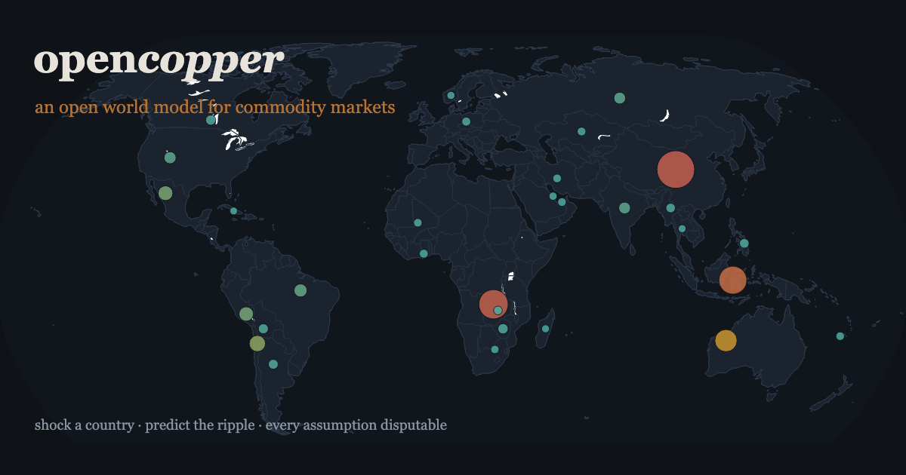

# opencopper

[](https://github.com/chang-07/opencopper/actions/workflows/ci.yml)
[](https://chang-07.github.io/opencopper/)
[](LICENSE)

### ▶ [Live demo — shock a country, predict the ripple](https://chang-07.github.io/opencopper/)

[](https://chang-07.github.io/opencopper/)

Try a deep link: [the DRC at −50%](https://chang-07.github.io/opencopper/#sim=country,Congo%20(Kinshasa),50) ·
[Indonesia nickel at −40%](https://chang-07.github.io/opencopper/#sim=country,Indonesia,40) ·
[batteries demand −30%](https://chang-07.github.io/opencopper/#sim=driver,batteries,30,down)

**An open supply/demand world model for mined commodities.** Copper gets the
full treatment — an LLM-built, mine-level ledger plus a transparent simulator
for the shocks that move the market (mine disasters, smelter closures, export
blocks, tariffs). Ten more majors (nickel, cobalt, lithium, zinc, rare earths,
aluminum, iron ore, gold, silver, tin) get a country-level tier built from
USGS data: concentration metrics and dominant-producer shock scenarios —
including the *real* DRC cobalt quotas and China REE export controls.

Commercial models (Wood Mackenzie, CRU, S&P, Benchmark) are excellent — and
enterprise-priced, black-box, output-only. opencopper takes the opposite
position: **every assumption is a line in a YAML file you can read, dispute,
and PR.** The model is wrong, like all models — but it shows its work.
Full formal writeup: [docs/methodology.md](docs/methodology.md).

**It makes falsifiable calls:** [PREDICTIONS.md](PREDICTIONS.md) is a
timestamped registry of the model's pre-resolution predictions (the June 30
tariff decision, Panama, the 2026 ICSG balance), graded publicly when each
resolves — hits and misses both stay forever.

**It is a real stochastic world model, not a trend line.** Market states come
from 34 years of price history (regimes: glut/balanced/tight); a Monte Carlo
engine draws thousands of futures from disruption + demand-surprise
distributions **calibrated so simulated volatility (22%) matches realized
(22%)**; and the interactive World Simulator lets you click a producer country,
shock its supply, and watch the predicted cross-commodity price ripple with
uncertainty bands. `opencopper montecarlo`, `history`, `validate`.

```
$ opencopper simulate --scenario scenarios/world-2026.yaml

scenario: world-2026 — Composed actuals: Grasberg mud rush, Kamoa-Kakula seismic
recovery, El Teniente carryover, TC/RC smelter closures

year   supply   demand  balance   Δ base  inv days  TC prs  US prem
-----------------------------------------------------------------
2024    26737    26800      -63       +0      11.2    3.4%     0.0%
2026    26350    26790     -440     -441       5.1    3.1%     0.0%
...
```

## Why this exists (June 2026)

Copper is the most interesting market in the world right now and there is no
open artifact to reason about it with:

- LME hit a record **~$14,500/t**; COMEX a record **$6.716/lb** (May 13).
- Treatment charges settled at **$0/t** (spot went *negative*) — smelters are
  paying for the privilege of smelting, and shutting down (Pasar, Tsumeb).
- **Grasberg**, the world's #2 mine, is recovering from the Sept 2025 mud rush
  with full recovery pushed to **2028**.
- Panama decides on the **Cobre Panamá** restart **this month**; the US
  Commerce report on refined-copper tariffs is due **June 30, 2026**.
- ICSG flipped its 2026 forecast from a +209kt surplus to a **-150kt deficit**.

Both June catalysts ship as scenario files. Run them before the decisions land;
compare against reality after.

## How it works

```
EDGAR EX-96 exhibits ──> LLM extraction (cited, schema-validated) ──┐
USGS / ICSG / company reporting (seed estimates) ───────────────────┼──> mine ledger
                                                                    │
                              data/seed/assumptions.yaml ───────────┼──> balance engine
                              scenarios/*.yaml (shock events) ──────┘        │
                                                                   CLI table + HTML report
```

Two coupled annual balances, because the market clears in two stages and the
2025-26 squeeze lives in the first one:

1. **Concentrate**: mine supply (ex SX-EW) vs smelter intake capacity. Scarcity
   here is what drove TCs negative — reported as `tc_pressure`.
2. **Refined**: smelted output + SX-EW + scrap vs regional demand. The balance
   flows into inventory cover, reported as `price_pressure` — an index,
   deliberately **not** a price forecast.

Tracked mines (31 today, ~45% of world supply) are modeled individually; the
rest of the world is an explicit aggregate with a disruption allowance. Shocks
are typed, parameterized events (`MineOutage`, `MineRestart`, `SmelterClosure`,
`DemandShock`, `Tariff`, `ExportBlock`) composed in YAML scenario files.

## Quickstart

```bash
uv sync
uv run opencopper ledger                                            # the mine ledger + world coverage
uv run opencopper simulate --scenario scenarios/grasberg-2025.yaml  # backtest the mud rush
uv run opencopper simulate --scenario scenarios/us-refined-tariff-2026.yaml
uv run opencopper sensitivity                                       # which assumption matters most
uv run opencopper export-web && python3 -m http.server -d web      # the interactive demo
```

### The world model: history, simulation, validation

```bash
uv run opencopper history --commodity copper      # 34yr regimes + realized volatility
uv run opencopper validate                         # calibrate the simulator to history (22% ≈ 22%)
uv run opencopper montecarlo --scenario scenarios/grasberg-2025.yaml   # P10/P50/P90, P(deficit), P(spike)
uv run opencopper regional --scenario scenarios/us-refined-tariff-2026.yaml  # quarterly COMEX-LME arb
uv run opencopper signals [--json]                 # desk sheet: model vs live market (not advice)
uv run opencopper backtest [--horizon 12]          # 34yr walk-forward: does the regime signal predict?
uv run opencopper book examples/book.yaml --risk   # correlated VaR/ES on YOUR declared exposures
uv run opencopper theses [--json]                  # scorecard: every call marked to market daily
uv run opencopper data status                      # every cache: age, rows, latest date, TTLs
uv run opencopper sensitivity --target price                           # the pricing parameters' own tornado
```

### Products: from raw commodities to the bottom line

```bash
uv run opencopper product list                     # cost stacks + live input-cost pressure
uv run opencopper product report ev-battery-pack --scenario scenarios/commodities/hormuz-disruption.yaml
uv run opencopper ripple --commodity copper --country "Congo (Kinshasa)" --severity 0.5
#   ...now ends with the PRODUCT stage: cable +14%, battery pack +8% (via cobalt), solar +1%
```

**22 commodities, 7 products.** The pool grew by lead, platinum, uranium,
coal, corn, soybeans, graphite and manganese (all keyless: FRED/Pink
Sheet/USGS/EIA/USDA/WNA) — and **graphite now outranks cobalt as the most
concentrated commodity in the model** (China ~76% vs DRC ~74%). On top sit
bill-of-materials product models — EV battery pack, steel, US gasoline,
bread, solar module, copper cable, urea — that answer three questions: what
share of the bottom line is each commodity, what is the input-cost pressure
at today's prices, and what does any shock do to the cost base. The spread
is the story: cable is ~80% metal, bread ~5% wheat. A DRC copper outage
reaches the battery pack mostly through the **cobalt byproduct channel** —
linkage graph → incidence → BOM, composed. Cost-base passthrough only;
margins, contracts and pricing power are named as unmodeled.

**The system grades its own calls.** `data/theses.yaml` is PREDICTIONS.md in
machine-readable form; markable theses grade themselves off keyless series
(the copper-2026 band call reads its own YTD standing every run), external
ones glow NEEDS-RES when their deadline passes ungraded, and **every
rule-matched news event becomes an auto thesis** ("≥+5% vs snapshotted entry
within 6 months") that the daily Action re-marks — so the news→simulation
loop's predictive value is itself measured, hit rate and Brier score
included, on the demo's **Scorecard** tab.

**The desk shows its homework.** The regime signal is backtested walk-forward
over 34 years with Newey-West t-stats: 9/10 commodities mean-revert toward
their trailing trend, but the legs are asymmetric — depressed (glut) markets
recovered +12–21% over the following 12 months while elevated (tight) markets
were **not safely shortable** (−95% max drawdown on the short leg; the right
tail the spike-odds column prices). Volatility is conditioned on the current
regime (extreme states are volatile states), incidence outputs carry
elasticity-uncertainty bands (`+18%` becomes `+10..+44%` — when the band is
wide the elasticities are doing the work), and the exposure book gets
delta-normal VaR/ES from measured correlations, labeled as the floor it is.
Evidence about signals, never sizing or advice.

**The regional layer models the arb itself.** A quarterly US/China/RoW
trade-flow model: contracted baseline flows meet structural deficits, marginal
cargoes chase regional premia with a shipping lag, and a tariff is a wedge the
marginal imported ton pays — so the simulated June-30 scenario reproduces the
observed 2025 sequence (anticipation spike → unwind → premium pinned at the
wedge). The Tariff Lab plots it per rate.

The Monte Carlo engine wraps the balance model in stochastic mine-disruption
and demand-surprise draws (mean-zero around the expected disruption, so the
median tracks the deterministic baseline) and returns **distributions**: a
price fan, probability of deficit, probability of a price spike — per year, per
scenario. The dispersion is calibrated by bisection so simulated annual price
volatility matches the 21.9% copper has realized since 1992. The Grasberg mud
rush, for instance, raises the modeled probability of a 2026 copper deficit to
~80%.

### The multi-commodity tier

```bash
uv run opencopper commodity list                # 11 majors, concentration at a glance
uv run opencopper commodity report cobalt --scenario scenarios/commodities/drc-cobalt-quota.yaml
uv run opencopper minmod fetch --commodity nickel && uv run opencopper minmod report --commodity nickel
uv run opencopper price                         # live FRED levels + anchors + elasticities
uv run opencopper price --commodity cobalt --supply-loss 0.46   # the DRC quota, priced
uv run opencopper commodity driver-shock --driver batteries --pct -25   # systemic demand shock
uv run opencopper commodity driver-scenario scenarios/commodities/ev-slowdown.yaml
```

**Demand drivers make shocks systemic.** Every commodity carries exposure
shares to global demand drivers (batteries, construction, grid, transport…),
so one event ripples across markets: an EV stall hits lithium −36% price,
cobalt −45%, then nickel, rare earths, aluminum, zinc, iron ore and copper —
correlation through shared demand, not hand-wired pairs. Price moves use the
exact constant-elasticity incidence `P/P₀ = (1±x)^(∓1/(η_d+η_s))`, clamped at
[0.25×, 4×] so the model reports "≥ +300%" instead of inventing a 900%, with
closed-form spike odds (P ≥ 2× anchor) against each commodity's realized
ambient volatility. The World Simulator has both modes: shock a **country's
supply** or shock a **demand driver**.

### Linkages + the news loop: it runs without anyone

```bash
uv run opencopper ripple --commodity copper --country "Congo (Kinshasa)" --severity 0.5
uv run opencopper news        # fetch headlines -> match rules -> simulate -> out/news-brief.md
```

**Shocks don't stop at one market.** A typed linkage graph
([`data/seed/linkages.yaml`](data/seed/linkages.yaml)) propagates each shock
one first-order round: **byproduct** (a 50% DRC copper outage is a +17%
copper move but a clamp-the-model **cobalt** squeeze, because cobalt rides
copper mines), **substitution** (copper up → aluminum demand up), and
**input-cost** (gas → aluminum smelting power, oil/gas → wheat fuel and
fertilizer).

**Headlines drive the simulator — keyless, no LLM in the loop.** A daily
GitHub Action ([`daily-brief.yml`](.github/workflows/daily-brief.yml))
fetches Google News RSS, matches transparent keyword rules
([`data/seed/news_rules.yaml`](data/seed/news_rules.yaml)) to country supply
events with **prior** severities, prices the ripple, commits a dated brief
to [`docs/briefs/`](docs/briefs/), and redeploys the live site (Desk tab →
Wire). The headline is always printed beside the simulated number so a human
judges relevance; the rules and priors are YAML anyone can dispute.

### The world model: history, simulation, calibration

```bash
uv run opencopper history                       # 34 years of regimes: glut/balanced/tight
uv run opencopper montecarlo --scenario

Country-level supply from USGS Mineral Commodity Summaries (extracted by
LLM agents with world-total cross-checks — they catch the PDF footnote-fusion
artifacts), HHI/concentration metrics, dominant-producer shock scenarios, and
an **implied-price layer**: copper prices off the engine's inventory-cover
scarcity curve, the country tier off short-run elasticity-incidence
(`%ΔP = k / (|η_d| + η_s)`), with live FRED market prices where a keyless IMF
series exists. Illustrative, not a forecast — every elasticity is a disputable
line in [`data/seed/prices.yaml`](data/seed/prices.yaml).
The tier reports balance **drift** (change vs its anchor year), never absolute
balances — mine supply and consumption sit on different bases for several
commodities, and only the copper engine has the secondary-supply structure to
close that gap. What it's genuinely good at is the question of the moment:
**what happens when Indonesia (67% of nickel), the DRC (74% of cobalt), or
China (69% of rare earths) restricts supply.** Two of the three shipped
scenarios are real 2025 policy events, parameterized from the USGS-stated
facts.

`sensitivity` runs the one-at-a-time tornado over every world assumption. A
nice property of an explicit-constraint model: smelter utilization shows zero
swing in the baseline *because the market is concentrate-bound* — the tornado
exposes which constraints bind, not just which numbers are big.

### The extraction loop (needs `ANTHROPIC_API_KEY`)

```bash
uv run opencopper ingest --max 20                  # download EX-96 exhibits (HTML + PDF)
uv run opencopper extract data/raw/<exhibit>.pdf   # one document, cited structured output
uv run opencopper batch submit data/raw            # bulk via the Batches API (50% cheaper)
uv run opencopper batch status <batch_id>
uv run opencopper batch collect                    # validate -> data/extracted/*.json
uv run opencopper reconcile                        # diff extractions against the seed ledger
uv run opencopper eval                             # score against hand-verified ground truth
```

Extractions never overwrite the ledger silently: `reconcile` surfaces every
discrepancy for review (two sources, diffed — the fintech way), and `eval`
treats an uncited value as wrong even when the number is right.

### Running it for ~$0

The model and demo need **no LLM spend at all** — the seed ledger and simulator
are self-contained, and real sample extractions for five mines are committed.
Extraction is an optional layer to upgrade seed values to cited ones, and it's
cheap by design:

- **You don't need the whole corpus.** Replacing seed values for the ~30 mines
  that matter is a few dozen documents, not the ~2,400 on EDGAR.
- **Section pre-filter** keeps only the high-signal sections of each report —
  ~84% fewer input tokens (measured: 262K → 43K on two real filings).
- **Pick the tier.** `--model claude-haiku-4-5` is ~5× cheaper than Opus on
  input and fine for structured extraction; the Batches API halves it again.
- **See the bill first:** `opencopper estimate data/raw --model claude-haiku-4-5`
  prints token counts and cost for full vs pre-filtered, no API call.

```
$ opencopper estimate data/raw --model claude-haiku-4-5
2 documents, model claude-haiku-4-5
  full text:      ~   262,034 in-tokens  ->  $0.28
  pre-filtered:   ~    42,570 in-tokens  ->  $0.06
  + Batches API (50% off):                       $0.03
```

A realistic ~40-document fill lands near **$1** (Haiku, pre-filtered, batched);
the entire EDGAR corpus is **~$40**, not the ~$1,900 a naive full-text Opus run
would cost.

### MinMod: the global deposit layer (free, and a cautionary tale)

```bash
uv run opencopper minmod fetch    # ~4,300 copper deposits, 9 requests, $0
uv run opencopper minmod report   # summary + ledger matches + quarantine stats
```

[MinMod](https://minmod.isi.edu) is DARPA CriticalMAAS's MIT-licensed knowledge
graph of machine-extracted mineral-site data — it covers the NI 43-101 universe
that never reaches EDGAR. Ingesting it produced the project's best argument for
verification layers: **72 records (1.7% of sites) carried 90% of the reported
contained copper** — values like a single 5.6 Gt deposit, several times USGS's
estimate for *all world copper reserves* — almost certainly upstream
unit-conversion errors. The ingester quarantines anything above a
physical-plausibility ceiling (150 Mt contained Cu, larger than any known
deposit), uses only plausible records for ledger matching, and reports what it
excluded. Machine-extracted data is a reference to reconcile, never a value to
trust blind — that's the whole thesis of this repo.

The plausible remainder (~4,200 deposits, 27 of 31 tracked mines name-matched)
feeds the **deposit pipeline layer on the web demo's map**: production in
copper, the known endowment in teal.

TLS note: minmod.isi.edu omits its intermediate certificate, so Python's
bundled CA store fails where browsers succeed. The client uses
[`truststore`](https://github.com/sethmlarson/truststore) (the OS trust store,
same approach as pip) rather than disabling verification.

## Data sources (all free)

| Source | Used for |
|---|---|
| SEC EDGAR full-text search (EX-96 / S-K 1300 exhibits) | LLM extraction of mine-level data, with citations |
| USGS Mineral Commodity Summaries, ICSG monthly releases | World totals, calibration |
| Company production reports | Seed estimates for tracked mines |
| [MinMod (DARPA CriticalMAAS)](https://minmod.isi.edu) — live | ~4,300 copper deposits w/ grade-tonnage (MIT-licensed); the NI 43-101 universe without scraping SEDAR+ |
| FRED `PCOPPUSDM`, delayed COMEX | Price context (display only) |

## Honesty box

- **Seed numbers are estimates.** Every mine row is tagged `basis: seed-estimate`
  with a source note; the extraction pipeline exists to replace them with cited
  values. PRs correcting any number are exactly the point.
- **The simulator propagates shocks through an explicit balance. It does not
  predict prices.** `price_pressure` is inventory-cover arithmetic, not alpha.
- **v1 simplifications are documented in the code**: annual resolution, no
  rerouting lags or regional inventory splits for tariffs, stranded exports
  treated as lost supply.

## Verification

- `uv run pytest` — engine invariants: mass conservation, outage monotonicity
  ("removing supply never increases the surplus"), zero-rate tariff identity,
  smelter-constraint binding, determinism, plus direction-and-magnitude
  backtests for every shipped scenario.
- Extraction is benchmarked against values transcribed from the source filings'
  reserve/economic tables (the verbatim quotes live in each extraction's
  citation). A field counts as correct only if it is **within tolerance _and_
  carries a citation** — an uncited right answer is scored as a miss. Real run
  over five EX-96 filings (Freeport + Southern Copper),
  [samples here](evals/sample_extractions/):

  | mine | field | expected | extracted | ok |
  |---|---|---:|---:|:-:|
  | Cuajone | reserves_kt | 6,560 | 6,560 | ✓ |
  | Cuajone | mine_life_years | 48 | 48 | ✓ |
  | Buenavista | reserves_kt | 11,253 | 11,253 | ✓ |
  | Buenavista | mine_life_years | 28 | 28 | ✓ |
  | La Caridad | reserves_kt | 924 | 924 | ✓ |
  | La Caridad | mine_life_years | 11 | 11 | ✓ |
  | Toquepala | mine_life_years | 57 | 57 | ✓ |

  **7/7 fields correct.** (Reserve and mine-life conversions from Mlb / stated
  text; Toquepala's reserve table was dropped by the pre-filter and is honestly
  recorded as null rather than guessed.)

- `reconcile` then diffs every extraction against the ledger. On this set it
  agreed on Buenavista and Toquepala and flagged three for review — most
  usefully **La Caridad at −44.8%** (the TRS mine-only rate of 69 kt vs the
  125 kt seed), confidence 0.80: a real disagreement worth a human look, surfaced
  rather than silently overwritten.

## Web demo

`web/` is a zero-backend static site (GitHub Pages-ready — `pages.yml` deploys
it on every push): scenario sliders for the tariff rate and Grasberg severity,
a yes/no toggle on the Cobre Panamá decision, countdowns to both live June
catalysts, and the full ledger with per-row provenance. All runs are
precomputed by `opencopper export-web`; the "sliders" snap to a parameter grid.

## Roadmap

- [x] PDF exhibit support (most EX-96s are PDFs)
- [x] Batch extraction pipeline (Batches API) + reconcile + eval harness
- [x] Section pre-filter + `estimate` command (~84% token cut; see "Running it for ~$0")
- [x] Real extraction + eval (7/7) + reconcile on five live filings (Cuajone,
      Buenavista, La Caridad, Cerro Verde, Toquepala)
- [x] Web demo: scenario sliders, live catalyst countdowns, ledger browser
- [ ] Pre-filter: always retain the Mineral Reserve Statement section (Toquepala's
      was dropped); better HTML-table text extraction (Cerro Verde cells were caption-only)
- [ ] Extend to the remaining EX-96 filers and to non-US mines via MinMod
- [x] MinMod ingestion: 4,299 copper deposits fetched, plausibility quarantine,
      ledger matching, deposit-pipeline map layer (see "MinMod" section)
- [ ] MinMod follow-ups: per-site provenance links; commodity QID pinning;
      smarter outlier detection than a single ceiling (grade × tonnage
      consistency checks)
- [ ] Quarterly resolution; regional trade flows (the COMEX-LME arb properly)
- [ ] Monthly "model vs ICSG" balance updates

## License

MIT
